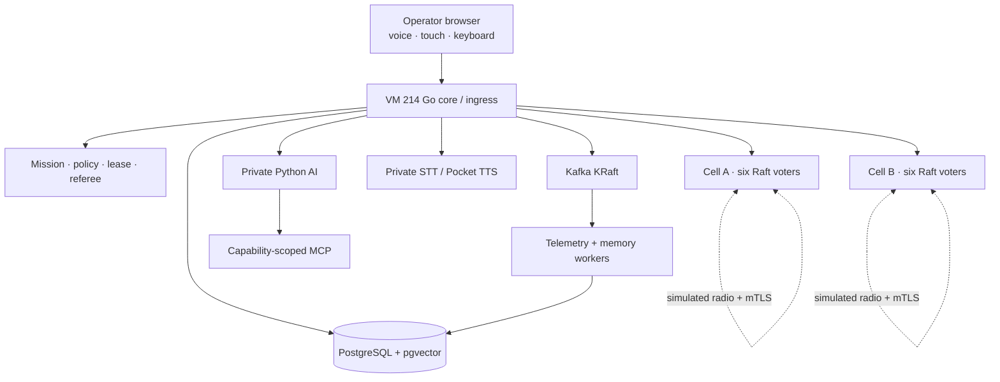

# KeelMesh

## Product Requirements Document

- **Document version:** 1.0
- **Product maturity:** Interview-ready engineering demonstration
- **Last verified:** 2026-09-04
- **Primary deployment:** VM 214 plus twelve vessel-node VMs
- **Repository:** `fourtytwo42/keelmesh`

> KeelMesh is a fictional maritime simulation and infrastructure demonstration. It is not a certified navigation, COLREG, weapons, anti-jam, or production vessel-control system.

---

## Contents

1. [Document purpose](#1-document-purpose)
2. [Executive summary](#2-executive-summary)
3. [Product thesis and principles](#3-product-thesis-and-principles)
4. [Users and primary journeys](#4-users-and-primary-journeys)
5. [Current product experience](#5-current-product-experience)
6. [Functional requirements](#6-functional-requirements)
7. [AI, voice, scenes, and MCP](#7-ai-voice-scenes-and-mcp)
8. [Mission authority and vessel autonomy](#8-mission-authority-and-vessel-autonomy)
9. [Fleet networking, consensus, and identity](#9-fleet-networking-consensus-and-identity)
10. [Data, memory, and learning](#10-data-memory-and-learning)
11. [Simulation model](#11-simulation-model)
12. [Architecture and deployment](#12-architecture-and-deployment)
13. [Security and safety requirements](#13-security-and-safety-requirements)
14. [Observability, verification, and evidence](#14-observability-verification-and-evidence)
15. [Implementation status](#15-implementation-status)
16. [Acceptance criteria](#16-acceptance-criteria)
17. [Guided demonstration](#17-guided-demonstration)
18. [Known limitations and production boundary](#18-known-limitations-and-production-boundary)
19. [Near-term roadmap](#19-near-term-roadmap)
20. [Success statement](#20-success-statement)

---

## 1. Document purpose

This PRD defines the current KeelMesh product, operator workflows, authority model, distributed runtime, acceptance boundary, and honest limitations. It supersedes the earlier M0-M5 interview-build PRD while preserving the original safety thesis.

This document distinguishes three states:

| Label | Meaning |
|---|---|
| **Implemented** | Present in the repository and exercised in the deployed demonstration |
| **Demonstrated** | Verified through a repeatable local, browser, VM, or fault-injection scenario |
| **Deferred** | Deliberately outside the current product boundary; no claim of completion |

Detailed procedures live in the [documentation portal](docs/README.md). Milestone design files remain historical records; this PRD and current source define present product intent.

## 2. Executive summary

KeelMesh is an AI-assisted command-and-control workspace for a simulated maritime fleet. It demonstrates how one operator can inspect twelve persistent vessel nodes, create temporary operational groups, author and approve missions, monitor execution, and safely continue through degraded connectivity, provider failures, backend interruptions, and suspicious positioning data.

The defining product boundary is:

> AI interprets, retrieves, explains, and proposes. Deterministic software resolves entities, plans trajectories, validates policy, binds approval, replicates authority, and executes.

The current deployment uses twelve Ubuntu vessel VMs, each mapped one-to-one to a visible simulated vessel. The vessels form two independent six-voter Hashicorp Raft cells. Each cell requires four votes for new authority. Raft traffic uses the simulated-radio network; management, browser ingress, metrics, and model-provider HTTPS use a separate management network. VM 214 is the non-voting ingress, referee, data platform, and demonstration host.

The system is built around failure conditions rather than a connected-only happy path:

- Direct Starlink loss falls back to simulated Wi-Fi HaLow routes.
- Isolation permits only cached, unexpired authority and local safety behavior.
- Suspicious GNSS observations are quarantined instead of moving the fused pose.
- AI, speech, Kafka, PostgreSQL, and VM 214 are not required for already committed vessel execution.
- Minority Raft partitions cannot create new fleet-wide authority.
- Cross-cell effects require matching quorum proofs and a shared future-activation certificate.

## 3. Product thesis and principles

### 3.1 Product thesis

Operational autonomy is credible only when intent, authority, execution, evidence, and failure behavior are separate and inspectable. KeelMesh therefore treats the model as a bounded collaborator rather than the control plane.

### 3.2 Product principles

1. **Authority before autonomy.** Consequential effects require deterministic validation and exact approval.
2. **Offline-first execution.** Vessels receive bounded signed work ahead of time and degrade safely when communication disappears.
3. **Reachability is not authority.** A node may relay traffic without gaining permission to alter a mission.
4. **One semantic path.** Human, voice, AI, browser, and MCP actions resolve to the same typed domain operations.
5. **Knowledge is scoped.** Hidden, faction, operator, mission, group, and vessel data are filtered before serialization or model context assembly.
6. **At-least-once transport, exactly-once logical effects.** Retries are expected; idempotency and state versions prevent duplicates.
7. **Evidence over animation.** Displayed health, failover, lag, proofs, and recovery derive from measured state.
8. **Honest boundaries.** Simulated radio, weather, contacts, and vessel physics are labeled as simulations.
9. **Graceful degradation.** Losing an optional quality layer must not widen authority or stop local safety.
10. **Human-legible operations.** Every important decision exposes targets, constraints, source, state version, and result.

### 3.3 Non-goals

KeelMesh does not provide certified marine navigation, physical propulsion or sensor control, proven physical radio/GNSS performance, production PKI, globally linearizable twelve-node consensus, Kafka broker HA, or unbounded model autonomy.

## 4. Users and primary journeys

### 4.1 Fleet operator

The operator selects vessels, creates temporary groups, defines missions, refines routes, confirms exact plans, monitors execution, and intervenes when authority, energy, PNT, separation, or connectivity changes.

> Inspect fleet -> select vessels or groups -> create mission -> define intent and geometry manually or with AI -> preview validated plan -> confirm exact action -> monitor execution and evidence.

### 4.2 Autonomy engineer

The autonomy engineer inspects route constraints, PNT arbitration, mission programs, local contingencies, formation behavior, and deterministic policy decisions. The Engineer workspace emphasizes diagnosis and operational tuning.

### 4.3 Platform and ML-infrastructure engineer

The platform engineer inspects Kafka flow, worker health, PostgreSQL/pgvector state, memory retrieval, provider routing, MCP receipts, A2UI composition, node health, Raft terms and indexes, mTLS identity, and fault recovery. System/Cutaway emphasizes architecture and proof.

### 4.4 Interviewer or evaluator

The evaluator may use the regular interface or start the hands-off guided demonstration. The demo clearly distinguishes deployed software from simulated physical conditions and provides drill-down evidence for technical claims.

## 5. Current product experience

### 5.1 Operations workspace

The default interface is a graphite, map-first workspace covering Narragansett Bay, Block Island, and Rhode Island Sound. It supports mouse, keyboard, touch, and release phone/tablet layouts.

Persistent elements include top navigation and mission tabs, the MapLibre operating picture, Fleet and Mission workspaces, environment/layer controls, authority and connectivity status, simulation speed/game time, a minimized-window shelf, and global microphone/text-chat controls.

Movable detail windows support focus, resize, minimize, restore, and close. Vessel and group windows are independent. Minimized detail windows enter a horizontally scrollable shelf; closing removes them. Fleet and Mission are top-level workspaces and toggle from navigation rather than accumulating duplicate shelf entries.

### 5.2 Fleet

The production demonstration begins with twelve persistent, unassigned vessels scattered across validated open water. Each vessel has a stable UUID, callsign, designation, class, VM mapping, position, energy state, communications state, PNT state, and mission binding.

Fleet supports search, individual and multi-selection, visible/all-authorized selection, operational-group management, unassigned vessels, inspection, map framing, drag/drop or explicit membership changes, selection clearing, and touch-safe contextual actions. Groups do not alter Raft-cell membership. Missions may target individuals, groups, or mixed selections across cells.

### 5.3 Mission

Mission is a manual-first editor with optional bounded AI refinement. Fleet selection is the source of assigned assets; Mission does not duplicate the full asset browser.

Mission supports task/target selection, operating and exclusion areas, waypoints, routes, holds, orbits, patrols, searches, rendezvous, moving-contact follow/intercept, formation/spacing, constraints, loop/completion behavior, mid-mission revision, deterministic route generation, optional AI refinement, and alternatives only when requested.

Creating from `+` or Mission opens the existing unsaved draft if one exists; otherwise it creates a uniquely named draft. Starting or saving that draft permits a subsequent new draft.

### 5.4 Map behavior

The map presents twelve controlled vessels, moving or anchored neutral contacts, bathymetry, shoreline-aware navigability, environment/communications/PNT layers, durable mission routes, moving target tracks, intercept points, ETAs, formation footprints, and scene-owned temporary annotations.

Completed route portions and passed waypoints are consumed rather than left as trails. Active mission overlays remain visible regardless of window focus. Touching empty water is inert; vessel tap opens inspection; long press opens its contextual menu.

### 5.5 Navy and Pirate modes

Navy uses standard nomenclature, controlled-vessel sprites, and Jarvis. Pirate changes presentation terminology and controlled-vessel art and uses Captain Barbossa. Neutral contacts and deterministic authority remain unchanged.

## 6. Functional requirements

### 6.1 Fleet and entity requirements

| ID | Requirement |
|---|---|
| FR-FLT-001 | Persist twelve default controlled-vessel identities and map each to one vessel VM. |
| FR-FLT-002 | Spawn controlled vessels in shoreline-validated navigable water. |
| FR-FLT-003 | Permit vessels to remain unassigned or belong to one operational group. |
| FR-FLT-004 | Permit missions to target individuals, groups, and mixed asset sets. |
| FR-FLT-005 | Resolve callsign, designation, group, color, contact, and speech-tolerant aliases against authorized live entities. |
| FR-FLT-006 | Opening a vessel from Fleet inspects and frames it without creating mission state. |
| FR-FLT-007 | Mouse, touch, keyboard, search, and AI selection resolve identical stable IDs. |
| FR-FLT-008 | Neutral contacts expose authorized identity, class, pose, course, speed, confidence, and observation age. |

### 6.2 Mission requirements

| ID | Requirement |
|---|---|
| FR-MSN-001 | Mission creation works with no selected assets and no AI provider. |
| FR-MSN-002 | Fleet selection updates the active draft's assigned assets through a versioned mutation. |
| FR-MSN-003 | Manual and AI-assisted changes use the same mission contract and validation path. |
| FR-MSN-004 | Relative instructions such as “one nautical mile east, then hold” resolve from current asset state without a manual waypoint. |
| FR-MSN-005 | Contact-relative instructions bind to a moving entity ID unless a fixed point is explicit. |
| FR-MSN-006 | Follow/intercept routes refresh as the target moves and use a feasible computed intercept. |
| FR-MSN-007 | Every vessel route is checked for navigability, reserve, speed, PNT, communications, separation, and authority. |
| FR-MSN-008 | The operator previews and approves an exact state/hash-bound plan before execution. |
| FR-MSN-009 | Deleting/completing a mission removes overlays and safely regroups/holds assets near current position. |
| FR-MSN-010 | Passed segments and waypoints disappear from the active route display. |
| FR-MSN-011 | Looping missions restart the route; non-looping missions hold at the final objective. |
| FR-MSN-012 | Active membership or constraint loosening invalidates stale plans and requires new approval. |

### 6.3 Formation and adaptation requirements

| ID | Requirement |
|---|---|
| FR-AUT-001 | Applicable formations include column, line abreast, wedge, echelon, parallel columns, dispersed screen, ring/orbit, and search grid. |
| FR-AUT-002 | Single-vessel missions do not offer multi-vessel formations. |
| FR-AUT-003 | Idle groups station-keep around a hold reference using real formation offsets and configurable spacing. |
| FR-AUT-004 | Groups use a deterministic eligible decision-maker; isolated vessels use their local policy. |
| FR-AUT-005 | Local collision, grounding, and short-horizon avoidance may adjust course inside mission guardrails without a model. |
| FR-AUT-006 | Complex adaptation may request AI, but deterministic planning and policy remain authoritative. |
| FR-AUT-007 | Adaptation outside cached guardrails requests authority or enters predefined safe behavior. |

### 6.4 Energy and simulation requirements

| ID | Requirement |
|---|---|
| FR-SIM-001 | Game time advances according to the selected simulation multiplier. |
| FR-SIM-002 | Controls include pause and logical acceleration through 500x. |
| FR-SIM-003 | Propulsion, station keeping, sensing, communications, inference, and equipment consume energy. |
| FR-SIM-004 | Solar input follows simulated day/night and visibly affects net power. |
| FR-SIM-005 | A full charge supports approximately 20 nautical miles under the nominal profile, with daylight extending endurance. |
| FR-SIM-006 | Unpowered vessels drift rather than stopping unrealistically. |
| FR-SIM-007 | Controlled vessels can overtake the fastest programmed neutral contact in supported intercept scenarios. |

## 7. AI, voice, scenes, and MCP

### 7.1 Global assistant

The global assistant is a first-class command surface available through push-to-talk or a secondary text conversation window. Voice and text share session history and semantic tools.

The assistant may answer grounded operational questions; select and frame visible entities; arrange permitted windows; create and revise groups or mission drafts; pause missions; propose deletion; and populate missions from relative, geographic, entity-relative, or constraint-rich language. It produces one recommended plan by default and alternatives only when asked. It asks a clarifying question when material ambiguity cannot be safely resolved.

The assistant must not claim data is unavailable when an authorized typed workspace tool can retrieve it.

### 7.2 Conversation context

Each turn receives:

- The latest twelve exact user/assistant turns for the operator session.
- Current authorized fleet, workspace, mission, contact, environment, and coordination state.
- Up to six scoped semantic memories.
- Up to four approved procedural chunks.
- Up to three relevant operational episodes.
- At most 8,000 estimated memory-context tokens.

Go performs deterministic recent-entity resolution so follow-ups such as “open its window” remain reliable even if a provider response is malformed or unavailable. Clearing chat removes current exact-turn history but does not delete long-term memory or audit records.

### 7.3 Provider routing

Connected mode prefers the configured OpenAI Responses API model, currently `gpt-5.6-luna`, followed by a bounded OpenRouter pool, an optional local OpenAI-compatible endpoint, and deterministic fallback. Requests use deadlines, circuit breakers, shared request identity, and one accepted response so late providers cannot duplicate actions.

Provider success improves interpretation and explanation; it never grants authority. Manual mission creation and deterministic safety remain available without any provider.

### 7.4 Voice

- STT uses VM/node-hosted `faster-whisper` with a bundled quantized English model.
- TTS uses Pocket TTS 2.1.0.
- Navy defaults to Jarvis; Pirate defaults to Captain Barbossa.
- Releasing push-to-talk finalizes and submits the transcript.
- New speech cancels unfinished inference/TTS where safe; committed actions remain audited.
- Text remains available when microphone, STT, or TTS fails.
- Raw voice audio is discarded after transcription.

Browser WebGPU/WASM STT benchmarking and trusted-peer routing remain follow-up work; browser TTS is not required.

### 7.5 Trusted operational scenes

A2UI scenes present decision boards, status matrices, evidence chains, mission summaries, approval cards, and temporary map annotations. The model emits `SceneIntentV1`; trusted Go composition resolves entities, permissions, bindings, and catalog components.

The renderer rejects raw model-generated HTML, JavaScript, CSS, arbitrary URLs, remote images, unknown components, hidden bindings, stale actions, and invalid sequences. Live values update from application state without another model call.

### 7.6 External MCP

The private MCP server exposes capability-scoped read, investigation, retrieval, replay, memory, presentation, and draft tools. External agents use the same semantic domain interfaces as the built-in assistant.

MCP cannot approve or start its own effects, promote or forget memory directly, mutate policy, bypass state versions, access hidden faction truth or secrets, execute shell commands, or reach arbitrary network targets.

## 8. Mission authority and vessel autonomy

### 8.1 Plan-before-action boundary

All movement follows one path:

```text
intent or manual edit
  -> typed mission draft
  -> deterministic route generation
  -> constraint and policy validation
  -> exact preview and content hash
  -> operator confirmation
  -> quorum-backed authority commit
  -> signed lease/program activation
  -> local execution and audit
```

No UI shortcut, AI response, voice phrase, MCP call, or referee action may skip this boundary.

### 8.2 Constraints

Effective constraints merge conservatively in this order:

1. Immutable hardware/class envelope.
2. Fleet defaults.
3. Operational-group policy.
4. Mission override.
5. Vessel override.

Minimum requirements use the highest value; maximum limits use the lowest; allowed areas intersect; prohibited areas union and expand by separation and uncertainty. Safer active changes may use a bounded safer-action path. Looser limits require exact new approval. Hardware and prohibited policy are non-overridable.

### 8.3 Signed trajectory programs

A mission compiles into an arbitrarily long signed trajectory program composed of ten-second envelopes. Every vessel materializes a rolling 60-second hot execution buffer from that complete program. “60 seconds” is buffer depth, not total mission duration.

Segments contain timestamped position/speed targets, corridors, reserve/separation/PNT envelopes, expiry, failure behavior, predecessor hash, and signature. They are not direct rudder or throttle commands.

Program revisions activate at a safe future boundary only after the affected set has the matching signed revision. Reconnection reports actual state and execution high-water marks, expires missed work, and bridges to a future valid point; it never replays stale commands or jumps a vessel.

### 8.4 Degraded behavior

When communication is lost, a vessel may continue committed work while its lease and constraints remain valid, perform deterministic local safety actions, execute an authorized communication-recovery behavior inside fixed budgets, and fall back to a lease-defined safe termination state.

It may not invent a mission, lower quorum, expand geography, loosen constraints, or treat reachability as authorization.

## 9. Fleet networking, consensus, and identity

### 9.1 Network planes

| Plane | Network | Purpose | Fault policy |
|---|---|---|---|
| Simulated mission/radio | `10.77.0.0/24` | Raft, mission bundles, mesh observations | May be impaired by approved drills |
| Management/inference | `192.168.50.0/24` | Browser, diagnostics, Proxmox, provider HTTPS | Never deliberately severed by radio drills |
| Public ingress | VM 214 / HTTPS tunnel | Operator and interviewer access | Ephemeral Quick Tunnel in this demo |

Fault tooling rejects management destinations and establishes an automatic rollback watchdog before changing radio conditions.

### 9.2 Consensus topology

The twelve vessel nodes form two independent fixed-membership cells:

- Cell A: six voters, quorum four.
- Cell B: six voters, quorum four.
- Each cell is distributed 2/2/2 across three Proxmox hosts.
- VM 214 is a non-voting gateway/referee.

Hashicorp Raft v1.7.3 and raft-boltdb v2.3.1 provide durable logs, stable state, FSM state, snapshots, and follower catch-up. A new leader becomes authority-ready only after committing an epoch advance in its current term.

A whole-host outage leaves four voters per cell. A 4/2 partition permits only the majority; a 3/3 split rejects writes. An isolated former leader cannot issue new authority. Followers may serve labeled stale reads but cannot acknowledge an effect without a leader barrier and quorum commit.

### 9.3 mTLS and application identity

VM 214 holds the offline demo root and Cell A/Cell B intermediates. Nodes receive Ed25519 TLS identities, separate application-signing keys, and root-signed fixed membership manifests.

Internal connections validate chain, expiration, URI SAN, IP SAN, cell, node ID, serial, role, and membership. Wrong-cell peers, unknown or duplicate identities, incorrect radio/management roles, revoked or expired certificates, and plaintext connections fail before application handling.

Private keys remain outside Git and images, use mode `0400`, and live under directories mode `0700`. Public certificates/manifests use mode `0444`.

### 9.4 Quorum proof and cross-cell activation

Each applied command produces a signed acknowledgement over cell, term, log index, authority epoch, command hash, and resulting state hash. VM 214 requires four distinct current-member signatures before applying a consequential mission or Arena effect.

Cross-cell operations are not twelve-node consensus. VM 214 canonicalizes an operation and future activation tick; both cells commit matching preparations; VM 214 verifies both proofs and signs an activation certificate; both cells commit that exact certificate before activation. Loss or mismatch before certification leaves the operation inactive.

### 9.5 Rollback modes

`KEELMESH_COORDINATION_MODE` retains `simulated`, `shadow`, and `raft`. The deployed demonstration runs `raft`; simulated and shadow remain explicit rollback and comparison modes.

## 10. Data, memory, and learning

### 10.1 Event pipeline

Kafka decouples telemetry and domain events from ingestion, aggregation, memory extraction, and replay. Producers use bounded buffers and bbolt outboxes. Consumers process at least once, validate/stage data, update PostgreSQL transactionally, and commit offsets only after persistence. Database uniqueness supplies logical deduplication.

The live appliance uses one Kafka KRaft broker. It demonstrates client recovery, backpressure, rebalance, replay, and deterministic projections—not broker HA.

### 10.2 Central storage and retrieval

PostgreSQL is the central operational and memory store. pgvector and full-text search support hybrid retrieval. Memory retains scope, source, revision, trust, confidence, timestamps, checksum, embedding version, classification, contradiction, and supersession/tombstone links.

Retrieval combines vector similarity, keyword relevance, freshness, trust, and outcome quality. Authorization filtering runs before browser/model serialization. Retrieved content is evidence, never executable instruction.

### 10.3 Learning policy

- Verified outcomes and explicit statements may commit within an authorized private scope.
- Inferences require at least 0.80 confidence, remain labeled, and yield to explicit corrections.
- Faction, procedural, and approved-global promotion requires approval of the exact candidate hash.
- Model output never writes directly to committed memory.
- Forgetting creates a tombstone; replay applies tombstones before additions.

### 10.4 Node-local memory

Vessel nodes use SQLite WAL for bounded context and bbolt for outbox, journal, and watermarks. A node caches only authorized vessel, mission, group/faction, runbook, and delegated operator context.

Node-local stores and contracts are implemented. Authenticated radio-plane memory-bundle exchange and complete reconnection synchronization remain deferred.

### 10.5 Optional memory lab

The optional `memory-lab` Compose profile adds private MinIO, Dagster, and MLflow services for document assets, ingestion, evaluation, experiments, and bounded artifacts. They are visible in System/Cutaway but are not dependencies of mission execution.

## 11. Simulation model

### 11.1 Operating environment

The map uses local/regional maritime assets and a pinned NOAA-derived fixture with provenance, timestamps, units, checksums, and attribution. Conditions are labeled **NOAA-derived simulation fixture**, never live or navigational data.

### 11.2 Navigation and traffic

The simulator models shoreline polygons, depth bands, vessel draft, safety margins, current/wind drift, waypoint progression, moving targets, and neutral traffic. Neutral vessels include route loops and anchored contacts with generated identities and unchanged presentation across Navy/Pirate modes.

### 11.3 Energy

Energy integrates simulated time, speed, nonlinear propulsion, base systems, sensors, communication, inference, equipment, station keeping, and daylight solar. Inspectors expose reserve, projected reserve, solar input, draw, net power, and charging/discharging state.

Idle unassigned vessels continue through the day/night energy model. Accelerated simulation visibly advances energy, not merely the clock.

### 11.4 PNT

The PNT arbiter combines GNSS with simulated inertial, speed, bathymetry/shoreline, radar/vision, and authenticated relative evidence. States are `trusted`, `suspect`, `denied`, and `unsafe`.

An impossible GNSS jump is excluded and recorded; fused position does not follow it. Action scope and speed shrink as uncertainty grows. Dead reckoning is bounded and never presented as indefinite.

## 12. Architecture and deployment

### 12.1 Runtime overview



### 12.2 Technology choices

| Concern | Current choice |
|---|---|
| Core, planner, simulation, authority | Go 1.27 modular monolith and role-specific binary |
| Consensus | Hashicorp Raft 1.7.3; raft-boltdb/v2 2.3.1 |
| Browser | React 19.2.8, TypeScript 5.9, MapLibre GL 6.6, Lucide |
| Trusted generated UI | A2UI React 0.11.0, Zod 3.25.76, server-owned catalog |
| AI | Private Python service plus Go-owned context/tools/policy |
| Primary provider | OpenAI Responses API, configured `gpt-5.6-luna` |
| Fallback | OpenRouter, optional local endpoint, deterministic/manual |
| Speech | faster-whisper 1.2.0; Pocket TTS 2.1.0 |
| Event platform | Apache Kafka KRaft 4.2.1 and Go workers |
| Operational/memory store | PostgreSQL 17 and pgvector 0.8.6 |
| Node-local state | SQLite WAL and bbolt |
| Optional MLOps | MinIO, Dagster, MLflow |
| Packaging | Docker Compose, embedded web build, one published app port |

Versions reflect source manifests verified 2026-09-04.

### 12.3 Deployment profiles

| Profile | Purpose | Authority posture |
|---|---|---|
| Local appliance | Core product on one Linux host/VM | Deterministic/manual and compatibility drills |
| Connected interview | VM 214 plus twelve vessel nodes | Real two-cell Raft and guided demo |
| Offline | No cloud provider | Cached execution and deterministic planning |
| Scale lab | Synthetic load and workers | Pipeline throughput/recovery measurement |
| `memory-lab` | Private MLOps additions | Optional; never mission-critical |
| Production shape | Kubernetes/AWS manifests | Design artifact; no deployment claim |

### 12.4 External exposure

Only application port `8080` is published by the default appliance. PostgreSQL, Kafka, AI, speech, MCP, and memory-lab remain private. Cloudflare Quick Tunnels provide temporary HTTPS; hostnames are explicitly ephemeral.

## 13. Security and safety requirements

### 13.1 Authority classes

| Class | Examples | Required behavior |
|---|---|---|
| Presentation | Frame map, select, open window | Immediate after visibility validation |
| Reversible draft | Objective, geometry, formation | Versioned/audited; invalidates stale plans |
| Bounded safer action | Pause, tighten, local hold | Policy check and receipt |
| Consequential | Start, loosen, active membership, delete, effect | Exact state/hash approval and quorum proof |
| Prohibited | Self-signing, hidden truth, shell, secrets, bypass | Tool is not exposed |

### 13.2 Required controls

| ID | Requirement |
|---|---|
| SR-001 | Persistent mutations carry request ID, idempotency key, actor, expected state, and entity versions. |
| SR-002 | Idempotency-key reuse with different canonical content fails closed. |
| SR-003 | Stale plans, versions, epochs, certificates, or target expansions cannot execute. |
| SR-004 | Browser and model contexts receive only authorized serialized fields. |
| SR-005 | Prompt-injection evidence cannot change tools, authority, or memory policy. |
| SR-006 | Models receive no signing keys, DB/Kafka credentials, shell, filesystem, arbitrary network, or hidden-referee access. |
| SR-007 | Radio faults cannot target management or deliberate provider connectivity. |
| SR-008 | Secrets, raw environments, and voice audio cannot enter Git, images, logs, APIs, metrics, memory, or evidence. |
| SR-009 | Consequential effects require four valid current-member signatures; cross-cell effects require both cells. |
| SR-010 | AI/provider failure cannot expand authority or disable deterministic safety. |

## 14. Observability, verification, and evidence

### 14.1 Product observability

Engineer explains vessel/autonomy behavior. System/Cutaway explains end-to-end platform behavior.

Engineer includes route state, mission-program depth, constraints, local decision state, PNT evidence, communications, energy, and adaptation reason codes.

System/Cutaway includes service topology, event flow, Kafka lag, PostgreSQL/pgvector, memory assembly, provider attempts, MCP receipts, A2UI lifecycle, node CPU/RAM, network planes, Raft leader/term/epoch, quorum, commit/applied indexes, follower lag, state checksums, certificate identity/expiry, proofs, and cross-cell preparation.

### 14.2 Test layers

| Layer | Gate |
|---|---|
| Go | Unit/integration tests and `go vet` |
| TypeScript | Strict typecheck and Vitest |
| Python | pytest, typing/lint/security checks where configured |
| Contracts | Mirrored fixtures and canonical hashes |
| Browser | Playwright and focused mouse/touch/phone workflows |
| Appliance | Compose validation and milestone verifiers |
| Nodes | Binary hash, health, identity, storage, and network-plane checks |
| Distributed | Election, partition, proof, convergence, and cross-cell drills |

### 14.3 Evidence requirements

Performance and resilience claims identify commit, image/binary digest, seed/profile, hardware, load, latency percentiles, lag, recovery time, and dropped/duplicate/quarantined records. Evidence exports exclude secrets and raw voice audio.

GitHub-hosted workflows are intentionally unused. Verification runs on VM 214 and the twelve nodes. Proxmox snapshots require a fresh thin-pool preflight and explicit authorization; normal development and verification create none.

## 15. Implementation status

### 15.1 Milestone matrix

| Milestone | Delivered capability | Status |
|---|---|---|
| M1 | Deterministic planning, exact preview/hash authorization, execution | Implemented |
| M2 | Mission-tape incident, partition, PNT rejection, safe hold/rejoin | Implemented |
| M3 | Kafka/PostgreSQL pipeline, workers, quarantine, replay, metrics | Implemented |
| M4 | MCP investigation, retrieval, replay, evaluation approval | Implemented |
| M5 | Quiet Fleet quorum/arming/future commit and release commands | Compatibility workspace |
| M6 | Map-first Fleet/Mission, vessels, groups, formations, voice, touch | Implemented; default fleet now twelve |
| M7 | Symmetric node fabric and Fleet Arena vertical slice | Implemented vertical slice |
| M8 | Long signed trajectory programs and rolling hot buffers | Implemented |
| M9 | Capability-scoped external MCP boundary | Implemented read/draft boundary |
| M10 | Trusted A2UI scenes, live bindings, assistant tools, critical scenes | Implemented |
| M11 | Central/node memory, Kafka learning, replay, optional MLOps | Implemented with radio-sync follow-up |
| M12 | Two real six-voter Raft cells, mTLS, proofs, cross-cell activation | Implemented and deployed in Raft mode |

### 15.2 Verified deployment snapshot

As last verified on 2026-09-04:

- VM 214 serves the application and central data/AI platform.
- Twelve vessel VMs run the same healthy node binary.
- Both cells are distributed 2/2/2 across three Proxmox hosts.
- Leader replacement, 4/2 majority, 3/3 rejection, follower convergence, signed proof, and cross-cell activation drills pass.
- The default picture contains twelve unassigned vessels, zero groups, and no required active mission.
- Day/night energy progression works for assigned, executing, and unassigned vessels.
- Guided-demo cleanup no longer leaves scene windows reopening or map focus oscillating.
- `simulated|shadow|raft` modes remain; deployed authority uses `raft`.

Current shared delivery state lives in [Delivery status](docs/STATUS.md) and [Verification](docs/VERIFICATION.md). Exact local handoff details and transient infrastructure measurements are intentionally not published in this requirements document.

## 16. Acceptance criteria

### 16.1 Operator experience

- [x] Map, Fleet, Mission, microphone, chat, Engineer, System/Cutaway, and mission tabs operate on desktop, tablet, and phone layouts.
- [x] Mouse, keyboard, tap, long press, and touch scrolling have intentional behavior.
- [x] Twelve persistent vessels begin unassigned and in navigable open water.
- [x] Vessel selection, framing, inspection, grouping, and mission assignment use stable IDs.
- [x] Mission creation works without preselected assets or AI.
- [x] Manual and AI changes share the mission model and authority boundary.
- [x] Active route overlays survive focus changes and consume completed segments.
- [x] Navy/Pirate modes change presentation and voice without changing authority.

### 16.2 AI and memory

- [x] Voice and typed input share conversation history.
- [x] The assistant receives authorized live context and resolves follow-up entity references.
- [x] Normal mission requests return one plan; alternatives appear only when requested.
- [x] Informational questions do not create missions merely to answer.
- [x] Provider failure preserves manual planning and mission safety.
- [x] A2UI accepts only trusted catalog components and server-resolved bindings.
- [x] Central conversation and semantic memory survive browser reload and core restart.
- [x] Scope filtering, provenance, promotion, contradiction precedence, and tombstones are enforced.
- [ ] Complete authenticated radio-plane memory-bundle synchronization.
- [ ] Finish browser/node STT benchmarks and trusted-peer selection.

### 16.3 Mission and safety

- [x] No movement begins before preview, hash-bound confirmation, lease, and activation.
- [x] Relative and moving-contact instructions resolve without manual waypoint geometry.
- [x] Validation rejects land, grounding, exclusion, speed, reserve, PNT, authority, and separation violations.
- [x] Mission revisions invalidate stale previews and approvals.
- [x] Deleting/completing a mission removes overlays and does not return vessels to obsolete starting points.
- [x] Signed programs may exceed one minute while maintaining a rolling 60-second hot buffer.
- [x] Loss of AI, speech, Kafka, PostgreSQL, or VM 214 does not invalidate committed local execution.
- [x] Spoofed GNSS cannot move the fused marker; uncertainty constrains behavior.

### 16.4 Distributed authority

- [x] Each cell has six real voters and quorum four.
- [x] A whole-host outage leaves four voters per cell.
- [x] A 4/2 partition permits the majority and rejects the minority.
- [x] A 3/3 partition rejects new authority.
- [x] An isolated former leader cannot issue new effects.
- [x] Consequential effects carry at least four valid member signatures.
- [x] Restored nodes converge on one applied index and state checksum.
- [x] Cross-cell operations cannot activate from one cell's proof.
- [x] Wrong-cell, unknown, expired, revoked, malformed, or plaintext peers fail closed.
- [x] Radio faults leave management and intentional provider connectivity intact.

### 16.5 Data and verification

- [x] Kafka worker restart/rebalance does not duplicate committed projections.
- [x] PostgreSQL uniqueness/idempotency protect at-least-once processing.
- [x] Memory replay preserves revisions, tombstones, and checksums.
- [x] The guided demo uses live APIs/state with prerecorded narration.
- [x] No hosted workflow or automatic Proxmox snapshot is required.
- [ ] Replace legacy Playwright assertions targeting removed embedded Mission chat.
- [ ] Complete private OTLP cross-process trace ingestion.

## 17. Guided demonstration

### 17.1 Entry and personas

The centered **Start Demo** launches a hands-off walkthrough and changes to **Stop Demo** while active. Stop cancels automation/narration, restores normal speed, and removes demo-owned transient scenes and camera focus. It must not leave alerts or focus reopening.

Navy uses prerecorded Jarvis narration. Pirate uses the same technical sequence with prerecorded Captain Barbossa narration and flamboyant language. Both retain natural cadence; the complete Navy walkthrough currently runs about seven minutes.

### 17.2 Required beats

The demo must:

1. Establish the twelve VM-backed vessels and map-first interface.
2. Ask the assistant for grounded vessel information.
3. Create an operational group through typed tools.
4. Build and explain an AI-assisted mission.
5. Preview and confirm the exact plan.
6. Accelerate game time and show execution and energy change.
7. Demonstrate manual map authoring without AI.
8. Show Starlink loss and simulated HaLow continuity.
9. Inject suspicious GNSS movement and show PNT rejection.
10. Explain cached authority and bounded isolation behavior.
11. Show Engineer autonomy evidence.
12. Show System/Cutaway Raft, mTLS, proofs, Kafka/PostgreSQL, MCP/A2UI, and memory evidence.
13. Close with an implementation-versus-simulation boundary.

### 17.3 Required message

The audience should understand that KeelMesh was designed around real software failure modes: disconnected operation, partitions, stale work, suspicious position data, duplicate delivery, provider loss, worker recovery, and quorum loss. The product shows resulting state and evidence instead of only narrating it.

## 18. Known limitations and production boundary

### 18.1 Current limitations

- Starlink, HaLow behavior, GNSS sources/faults, environment, contacts, navigation, equipment, and vessel motion are simulated.
- No physical radios, marine sensors, propulsion system, or trial vessels are connected.
- The twelve nodes do not each host a separate GPU LLM/STT/TTS stack.
- Kafka is a single broker.
- Radio-plane memory synchronization is incomplete.
- Browser/node STT benchmarking and trusted-peer routing are incomplete.
- Remaining fixture retrieval should migrate to the bundled ONNX embedding path.
- Some Playwright coverage references superseded Mission chat.
- Quick Tunnel HTTPS addresses are ephemeral.
- Production PKI/HSM, automated revocation, dynamic Raft membership, external penetration testing, and certification are deferred.

### 18.2 Production hardening required

Before physical or safety-relevant deployment, the system requires independent hazard analysis, certified navigation/control boundaries, hardware-in-the-loop and sea trials, physical radio characterization, production identity/HSM integration, multi-broker/multi-zone infrastructure, security assessment, operational access control, disaster recovery, target-scale capacity testing, formal runbooks, and regulator/operator review.

## 19. Near-term roadmap

Priority is finishing evidence and integration debt rather than adding another broad feature milestone:

1. Replace legacy Mission-chat Playwright assertions with global Assistant and manual Mission workflows.
2. Complete signed radio-plane memory exchange, tombstone-first reconciliation, and partition tests.
3. Finish browser WebGPU, browser WASM, colocated-node, and trusted-peer STT benchmarks.
4. Replace remaining fixture embeddings/retrieval with the checksum-verified ONNX path.
5. Add private OTLP ingestion and cross-process trace correlation.
6. Establish named HTTPS ingress after domain/account selection.
7. Package a repeatable interview evidence bundle tied to deployed commit and binary hashes.

## 20. Success statement

KeelMesh succeeds when a technically skeptical evaluator can see one operator use voice, text, touch, or manual controls to plan and manage a distributed simulated fleet; trace every consequential action through deterministic validation, exact approval, quorum-backed authority, local execution, and immutable evidence; break connectivity, positioning, providers, workers, or leaders without creating unsafe authority; and clearly identify what is deployed software, deterministic simulation, and future production engineering.
