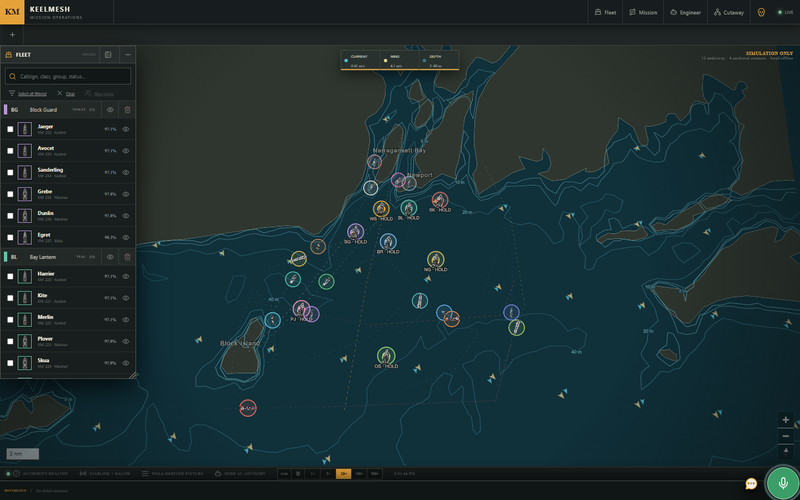
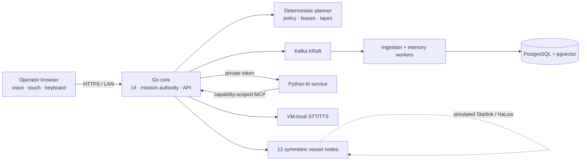

# KeelMesh

**A resilient, AI-assisted mission operations platform for a simulated maritime fleet.**

KeelMesh demonstrates how one operator can plan, authorize, observe, and adapt missions across a distributed fleet while keeping deterministic safety and human authority independent of cloud connectivity and model availability.

> Program the mission once. Coordinate locally. Adapt together. Degrade safely when the uplink disappears.



> The screenshot shows simulation data in Narragansett Bay and Rhode Island Sound. KeelMesh is not a certified navigation or vessel-control product.

## Watch the demo

[](https://www.youtube.com/watch?v=lCs2Dij3lYU)

**[Watch the complete KeelMesh demonstration on YouTube →](https://www.youtube.com/watch?v=lCs2Dij3lYU)**

The recording opens with live voice-assistant questions and AI-assisted mission creation, continues through the hands-off technical tour of fleet operations and resilient infrastructure, and concludes with the complete Pirate-mode demonstration.

## On this page

- [Watch the demo](#watch-the-demo)
- [Documentation index](#documentation-index)
- [What KeelMesh demonstrates](#what-keelmesh-demonstrates)
- [System at a glance](#system-at-a-glance)
- [Quick start](#quick-start)
- [Guided interview demo](#guided-interview-demo)
- [Core operating workflow](#core-operating-workflow)
- [Runtime profiles](#runtime-profiles)
- [Engineering principles](#engineering-principles)
- [Repository map](#repository-map)
- [Verification and release policy](#verification-and-release-policy)
- [Scope and disclaimer](#scope-and-disclaimer)

## Documentation index

| Start here | Purpose |
|---|---|
| [Documentation portal](docs/README.md) | Role-based index for the complete documentation set |
| [Operator guide](docs/OPERATOR_GUIDE.md) | Fleet selection, mission authoring, AI, voice, touch, and window behavior |
| [Architecture](docs/ARCHITECTURE.md) | Runtime topology, data planes, authority boundaries, and degraded operation |
| [AI and memory](docs/AI_AND_MEMORY.md) | Provider routing, MCP, A2UI, retrieval, memory, and human approval |
| [Operations runbook](docs/OPERATIONS.md) | Installation, secrets, startup, verification, recovery, and evidence export |
| [Security model](docs/SECURITY.md) | Threat model, trust boundaries, credentials, capabilities, and fail-closed rules |
| [Verification strategy](docs/VERIFICATION.md) | Test layers, acceptance evidence, performance claims, and known coverage debt |
| [API and repository reference](docs/REFERENCE.md) | Versioned APIs, service roles, important paths, and compatibility policy |
| [Delivery status](docs/STATUS.md) | Implemented milestones, honest limitations, and next investments |

The current product contract is the [PRD](PRD.md). Superseded milestone plans remain recoverable through Git history rather than appearing as active documentation.

## What KeelMesh demonstrates

- A map-first command workspace with twelve persistent named vessels mapped one-to-one to the twelve provisioned VM nodes, optional operator-created groups, neutral contacts, environmental fixtures, and concurrent missions.
- Manual mission authoring that remains usable with every AI provider offline.
- Optional AI refinement and a global voice/text assistant grounded in current fleet state plus the latest twelve exact session turns, with deterministic follow-up entity resolution.
- Exact-plan preview, policy validation, hash-bound authorization, signed trajectory programs, and a rolling execution buffer.
- Simulated Starlink and Wi-Fi HaLow failover, cached authority, PNT anomaly rejection, safe hold, and stale-safe rejoin.
- Real Kafka, PostgreSQL/pgvector, worker processes, backpressure, quarantine, replay, and measured scale-lab telemetry.
- A private MCP boundary, deterministic incident replay, human-approved evaluation promotion, and trusted A2UI operational scenes.
- Central and node-local memory with scoped retrieval, immutable provenance, tombstones, and deterministic projection replay.
- Twelve symmetric vessel-node VMs plus a neutral referee/ingress VM for distributed-system demonstrations.
- Two fixed six-voter Raft cells with radio-plane replication, four-signature effect proofs, cross-cell future activation, and separate Ed25519 mTLS identities; `simulated` and `shadow` remain guarded rollback modes during rollout.

## System at a glance



The LLM may interpret intent, retrieve evidence, organize the workspace, and propose changes. It cannot sign mission authority, bypass policy, approve its own effects, or replace deterministic navigation and safety checks. See [Architecture](docs/ARCHITECTURE.md) and [Security](docs/SECURITY.md).

## Quick start

### Requirements

- Linux host or VM with Docker Engine and Docker Compose
- Cached or pullable pinned images
- Optional provider key files for connected AI operation
- VM-local speech model assets for STT/TTS

### Start the appliance

```bash
git clone https://github.com/fourtytwo42/keelmesh.git
cd keelmesh
docker compose up -d --build
curl --fail http://localhost:8080/healthz
```

Only port `8080` is published. Kafka, PostgreSQL, AI, speech, workers, MCP, and optional memory-lab services remain private.

For the managed VM workflow:

```bash
scripts/keelmesh start
scripts/keelmesh status
scripts/keelmesh verify
```

Read the [Operations runbook](docs/OPERATIONS.md) before configuring provider secrets, running offline/restart drills, or exporting evidence.

## Guided interview demo

Select **Start Demo** in the center of the top bar for a hands-off tour of the
working system. Navy mode uses prerecorded Jarvis narration; Pirate mode follows
the same technical beats with prerecorded Captain Barbossa narration. The button
changes to **Stop Demo** during playback and stops automation immediately without
rolling back the state already demonstrated.

The tour resets transient Fleet Operations state, then exercises live application
interfaces to inspect a vessel with AI, create a group, build and authorize an
AI-assisted mission, accelerate execution, author a second mission manually, run
the connectivity/PNT resilience scenario, and inspect Raft/mTLS, Kafka/PostgreSQL,
MCP/evaluation, and distributed-memory evidence. Narration is served as bundled
audio; no TTS request occurs while the tour is running. Long-term semantic memory
is preserved by the demo reset.

The script explicitly distinguishes implemented infrastructure from simulated
conditions: the twelve VM nodes, two Raft cells, mTLS identities, quorum receipts,
data pipeline, and authority services are real software deployments; Starlink,
HaLow radio behavior, GNSS faults, environmental conditions, and vessel motion are
deterministic simulations. Both voices play at their natural cadence; allow about
seven minutes for the complete technical walkthrough, including ordinary live
API/provider latency.

## Core operating workflow

1. Select vessels or operational groups in **Fleet**.
2. Create or open a **Mission**.
3. Define the task, geometry, formation, constraints, and completion behavior.
4. Build a deterministic route, or explicitly ask AI to refine the existing mission.
5. Select a route to preview it on the live map.
6. Review and confirm the exact validated plan hash.
7. Observe execution, live solar/load battery flow, PNT, communications, tape depth, and adaptations.

Mission execution never depends on AI availability. On touch devices, tapping water is inert, tapping a vessel opens its details, and long-pressing a vessel opens its contextual actions.

## Runtime profiles

| Profile | Services | Purpose |
|---|---|---|
| Default | Core, PostgreSQL, Kafka, workers, AI, speech | Complete interview appliance |
| Offline | Cached images, isolated provider mode | Deterministic mission/resilience proof without outbound AI |
| `memory-lab` | Adds MinIO, Dagster, and MLflow | Optional ingestion, experiment, and artifact showcase |
| Vessel node | Symmetric Go/API/UI node with local stores | Per-vessel and coordinator-failover demonstrations |
| M12 coordination | Two independent six-voter Raft cells | Quorum authority, signed receipts, mTLS, and failover |

## Engineering principles

- **Authority before autonomy:** all consequential effects pass deterministic validation and exact approval.
- **Offline-first execution:** signed cached work and local safety continue when infrastructure disappears.
- **Knowledge is scoped:** operator, mission, vessel, group, and faction memories are filtered before serialization.
- **At-least-once, exactly-once logically:** Kafka retries are expected; database uniqueness and idempotency prevent duplicate effects.
- **Observable truth:** UI animation and evidence reports come from measured state, receipts, and spans—not canned narratives.
- **Honest boundaries:** simulations are labeled, performance claims are tied to measured hardware, and unfinished distributed features are documented as such.

## Repository map

```text
cmd/                    Go entrypoints and role dispatch
internal/               Mission, fleet, platform, AI, memory, and API domains
web/                    React, TypeScript, MapLibre, A2UI, Vitest, Playwright
ai/                     Python agent, providers, MCP client, retrieval, evaluations
speech/                 VM-local STT and TTS service
contracts/              Shared fixtures and compatibility contracts
scripts/                Verification, release, evidence, and operator commands
infrastructure/         VM/node provisioning and network safety tooling
deploy/kubernetes/      Production-shape Kustomize manifests; no cloud provisioning
memorylab/              Optional Dagster/MLflow/MinIO integration
docs/                   Maintained documentation portal
```

## Verification and release policy

Verification runs on VM 214 and the twelve vessel nodes. GitHub-hosted Actions are intentionally not used. A standard gate includes Go tests/vet, TypeScript/Vitest, Python checks, Compose validation, scenario verifiers, browser workflows, health checks, secret scanning, and evidence export.

```bash
scripts/keelmesh verify
scripts/keelmesh offline-verify
scripts/keelmesh restart-verify
scripts/keelmesh export-evidence
scripts/keelmesh m12-local-verify
scripts/keelmesh coordination-verify
```

No Proxmox snapshot may be created without storage preflight and explicit authorization. See [Verification](docs/VERIFICATION.md) for current coverage and known test migration work.

## Scope and disclaimer

KeelMesh is a fictional simulation and infrastructure demonstration. It does not claim certified navigation, COLREG compliance, production command authority, physical radio performance, anti-jam capability, broker high availability, or access to another company’s private architecture.

Secrets, cloned voice artifacts, model weights, runtime tokens, evidence containing sensitive values, and VM credentials must never be committed.
