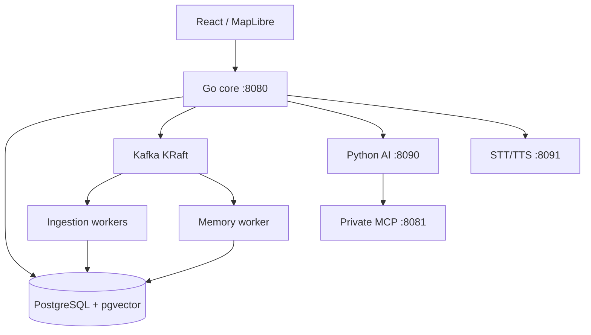

# Architecture

## Contents

- [Goals](#goals)
- [Runtime topology](#runtime-topology)
- [Planes](#planes)
- [Mission authority](#mission-authority)
- [Trajectory execution](#trajectory-execution)
- [Scale pipeline](#scale-pipeline)
- [Node fabric](#node-fabric)
- [Failure behavior](#failure-behavior)

## Goals

KeelMesh separates high-quality AI assistance from deterministic authority. It demonstrates bounded autonomy, offline execution, idempotent processing, scoped knowledge, auditable decisions, and graceful degradation.

## Runtime topology

The Go image uses role-specific entrypoints. The optional `memory-lab` profile adds private MinIO, Dagster, and MLflow services.

## Planes

| Plane | Responsibility | Failure posture |
|---|---|---|
| Mission authority | Plans, policy, leases, execution | Continues from cached authority |
| Simulated mission network | Starlink/HaLow routes | Faults affect only simulated links |
| Management/inference | Ingress, VM management, provider HTTPS | Never deliberately severed by radio drills |
| Telemetry | Kafka, workers, PostgreSQL | May lag/retry without stopping missions |
| AI | Interpretation, retrieval, scenes, evals | Degrades to fallback/manual |
| Memory | Scoped context and learning | Falls back to keyword/local/current turn |

## Mission authority

Consequential mutations are versioned and idempotent. Plans are validated for authority, geometry, hardware envelopes, speed, reserve, separation, PNT, communications, continuity, and expiry. Authorization binds an operator decision to the exact plan hash and state version.

AI can propose typed drafts; it cannot sign a lease or approve its own effect.

## Trajectory execution

Missions compile into signed ten-second segments. The complete program may be arbitrarily long; each vessel materializes a rolling 60-second hot execution buffer. Changes become future signed revisions that activate atomically at safe boundaries.

Reconnection reconciles high-water marks, expires stale work, and bridges forward without replay or position jumps.

## Scale pipeline

Producers use bounded franz-go buffers and bbolt outboxes. Workers consume at least once, validate, bulk-stage, update PostgreSQL transactionally, and commit offsets only after success. Database uniqueness suppresses logical duplication.

The platform records throughput, latency, lag, rebalances, quarantine, replay, CPU, and memory. The single local KRaft broker proves client recovery, not broker high availability.

## Node fabric

Twelve vessel VMs run the same Go/API/UI binary with management and simulated-radio interfaces. VM 214 remains neutral referee and ingress. Player/faction knowledge is filtered before serialization.

Implemented: symmetric protocol, local journals/memory stores, dual-plane safety, coordinator/failover demonstrations, and binary parity.

Not claimed complete: production Raft, full node mTLS, physical HaLow radios, twelve GPU/LLM services, or physical navigation/control.

## Failure behavior

| Failure | Expected behavior |
|---|---|
| AI/provider | Manual planner and deterministic safety continue |
| Speech | Typed interaction and missions continue |
| Kafka | Producers spool to bounded outboxes |
| PostgreSQL | Workers stop offset commits; cached missions continue |
| Direct Starlink | Simulated route uses HaLow relay |
| Complete partition | Cached authority, then contingency/safe hold |
| GNSS spoof | Observation excluded; fused marker does not jump |
| Core restart | Health returns; non-persisted demo state resets honestly |
